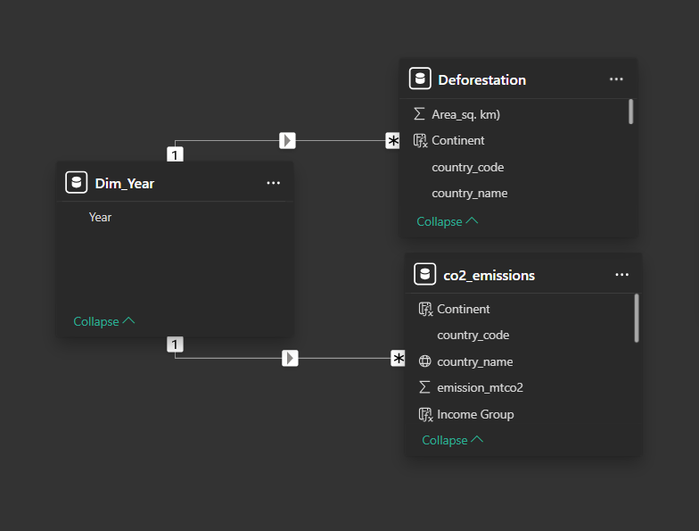
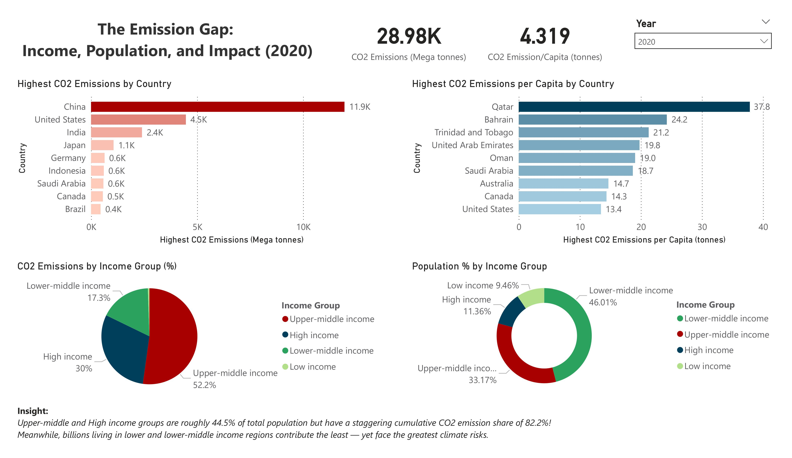
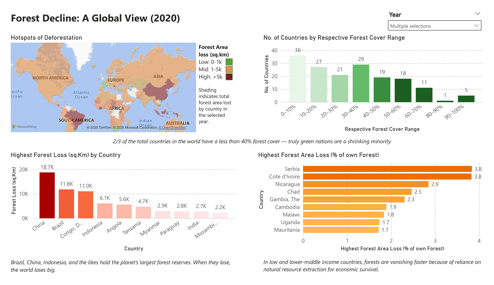
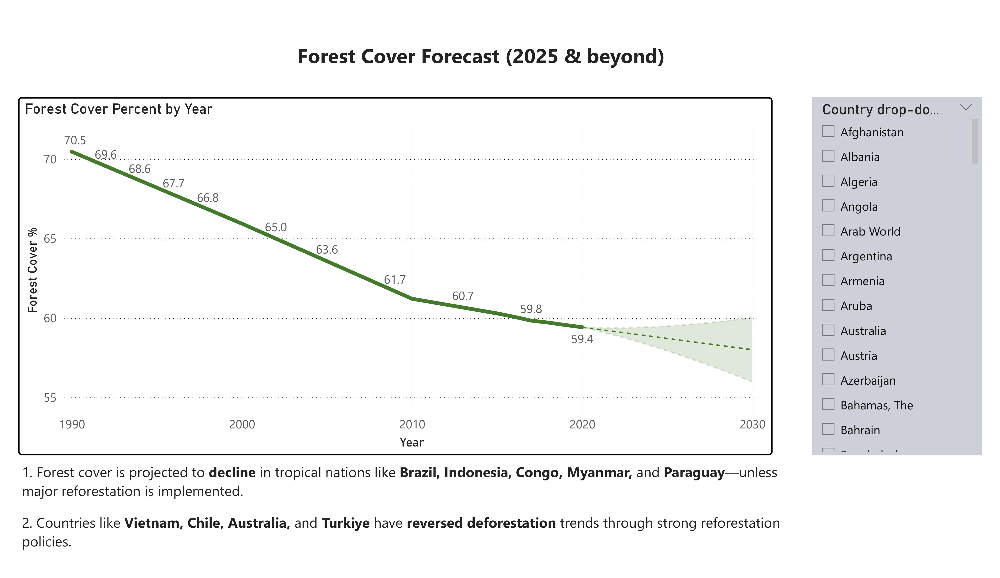

# 🌍 Sustainability Trends — CO₂ Emissions & Deforestation Analysis  

**A relational SQL + Power BI project exploring global inequalities in emissions and forest loss.**  
I built a MySQL database, cleaned data with Python/Excel, and created narrative-rich dashboards in Power BI to cut through misinformation and present clear insights.  

---

## ✨ Why This Project?
Climate change is often discussed emotionally — some minimize it, others exaggerate it.  
I wanted to apply **business analysis skills** to sustainability data to answer one question:  

👉 *“If data can solve business problems, why can’t it also clarify the truth about climate issues?”*  

This project is my attempt to use **data storytelling** to highlight where responsibility lies and where action is most urgent.  

---

## 🎯 Objectives
- Analyze global CO₂ emissions and deforestation from 1990–2021.  
- Compare trends across **income groups** and **population levels**.  
- Build dashboards that are **accessible, evidence-backed, and engaging** for both technical and non-technical audiences.  

---

## 🛠 Tools & Skills Applied
- **SQL (MySQL):** Built relational schema, joins, calculated columns, and PK constraints.  
- **Python (pandas):** Cleaned raw CSV (deforestation) programmatically.  
- **Excel:** Manual profiling & cleaning for other datasets.  
- **Power BI:** Data model, DAX measures, time intelligence, storytelling visuals.  
- **Accessibility & UX:** High-contrast visuals, simple navigation, alt text, readability focus.  

---

## 📂 Repository Structure
- [sql/](sql)  
  - [schema_and_etl.sql](sql/schema_and_etl.sql) → Creates tables and loads data from staging tables.  
  - [analysis_queries.sql](sql/analysis_queries.sql) → Analysis queries used to generate insights for dashboards.  
  - [validation_checks.sql](sql/validation_checks.sql) → Row counts, null checks, and min/max year checks.   
- [python/](python) → Data cleaning scripts (pandas)  
- [dax/](dax) → Power BI measures  
- [data/](data) → Clean datasets (population, income, land area, deforestation, emissions)  
- [docs/](docs) → project report pdf/Schema & dashboard images  
- [README.md](README.md) → This file  

---

## 🔄 Process Overview
1. **Extract** — Collected World Bank datasets on emissions, deforestation, population, land area, and income.  
2. **Transform** — Cleaned with Python & Excel; standardized headers, dropped nulls, profiled values.  
3. **Load** — Built a **MySQL relational database** with PKs (`country_code, year`) and merged fact tables.  
4. **Model** — Created a **star schema** with `dim_country` and fact tables (`Fact_Emissions`, `Fact_Deforestation`).  
5. **Visualize** — Designed a dual-page Power BI dashboard + 2025 forecast.  

---

# 📊 Visuals

### Database Schema

### Dashboards
**CO₂ Emissions (The Emission Gap)**  

**Deforestation (Forest Decline)**  
 

**Forest Cover Forecast (2025 & Beyond)**  

---

## 📊 Key Insights
- **The Emission Gap:**  
  - High/upper-middle income countries = **82.2% of global CO₂ emissions** but only **44.5% of the world’s population**.  
  - Per capita, Qatar (37.8t) and Bahrain are extreme outliers.  

- **Forest Decline:**  
  - Rapid loss in Brazil, Indonesia, and Congo.  
  - Serbia lost **3.8% of its total forest area in a single year**.  
  - Two-thirds of countries have <40% forest cover.  

- **Forecasting:**  
  - By 2025, tropical nations like Brazil and Indonesia continue downward trends without major reforestation.  
  - Positive turnarounds in Vietnam, Chile, and Türkiye due to strong reforestation policies.  

---

## 📈 Visual Design
- Two themed dashboards:  
  - *The Emission Gap* (income vs emissions).  
  - *Forest Decline* (global deforestation risk).  
- Forecast chart with Power BI’s built-in analytics.  
- Accessibility-first: clear labels, high contrast, alt text, big-font data labels.  

---

## 💡 Lessons Learned
- **ETL matters as much as visuals** — cleaning and consistent schemas saved hours of debugging later.  
- **SQL PK design** is critical for relational integrity. Using `(country_code, year)` was a game changer.  
- **Storytelling > charts** — recruiters and stakeholders remember narratives, not bar charts.  

---

## 🚀 How I’d Improve It (Next Iteration) 
- Automate the full ETL pipeline with **Python scripts** instead of manual Excel cleaning.  
- Deploy dashboards to **Power BI Service** for real-time interaction instead of local PBIX.  
- Integrate **cloud SQL (AWS RDS / GCP)** for production-scale datasets.  

---

## 📚 References

- [World Bank: Income per capita](https://data.worldbank.org/indicator/NY.ADJ.NNTY.PC.CD)  
- [World Bank: Population](https://data.worldbank.org/indicator/SP.POP.TOTL)  
- [World Bank: Land area](https://data.worldbank.org/indicator/AG.LND.TOTL.K2)  
- [World Bank: Co2 emissions](https://data.worldbank.org/indicator/EN.GHG.CO2.PC.CE.AR5)  
- [World Bank: Deforestation](https://data.worldbank.org/indicator/AG.LND.FRST.ZS) 

 

## 👤 About Me
I’m **Ritvaj Madotra**, a data analyst passionate about combining **SQL, BI, and storytelling** to drive impact.  
📌 Connect: [LinkedIn](https://www.linkedin.com/in/ritvajmadotra) | [GitHub](https://github.com/ritvaj)
